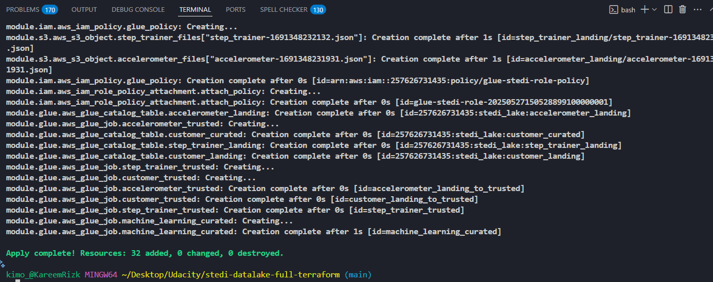
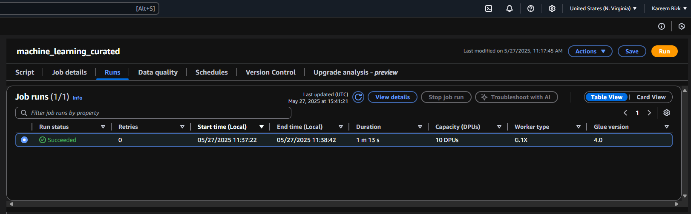
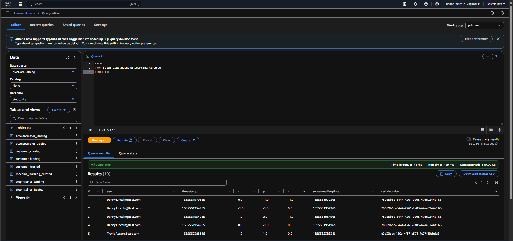
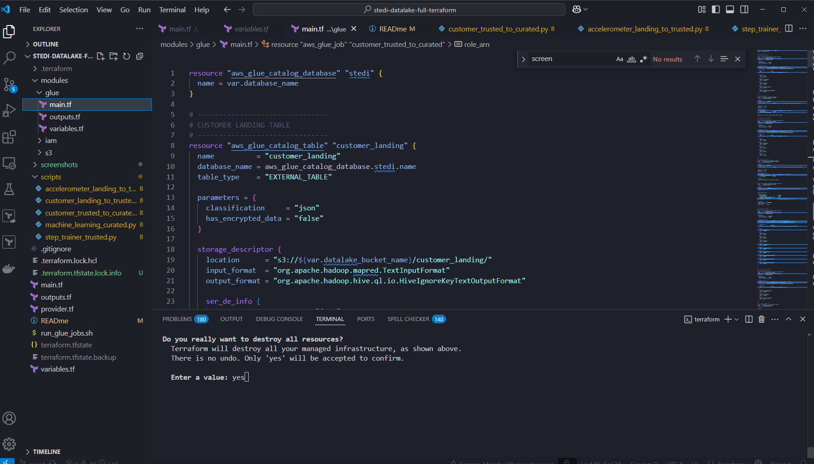

# STEDI Human Balance Analytics – Full Terraform Implementation

## 🧠 Project Overview

This project is a fully automated, end-to-end data lake pipeline deployed on AWS using **only Terraform**, transforming a previously GUI-based Glue Studio workflow into reproducible infrastructure-as-code.

> 🏗️ **Original Source**: This project was originally part of the Udacity Data Engineering Nanodegree. The original implementation used **Glue Studio Visual jobs**, which I fully refactored and rebuilt as a 100% **Terraform-based pipeline**.

The goal is to build a curated dataset from multiple IoT and app data sources (e.g. accelerometers, step trainer devices, and customer metadata) to support downstream **machine learning analytics**.

## 📌 Technologies Used

* AWS Glue (ETL Jobs, Data Catalog)
* Amazon S3 (Data Lake Storage)
* Terraform (Infrastructure as Code)
* Python (ETL logic)
* AWS Athena (Query layer)

## 🔁 Data Pipeline Flow (with Diagram)

```text
         +--------------------+           +---------------------+
         | customer_landing  |           | accelerometer_landing |
         +--------+----------+           +----------+----------+
                  |                               |
       customer_landing_to_trusted     accelerometer_landing_to_trusted
                  |                               |
         +--------v----------+           +--------v-----------+
         | customer_trusted  |<----------| accelerometer_trusted |
         +--------+----------+           +----------+----------+
                  |
       customer_trusted_to_curated
                  |
         +--------v----------+
         | customer_curated  |
         +--------+----------+
                  |
         +--------v----------+
         | step_trainer_landing
         +--------+----------+
                  |
         step_trainer_trusted
                  |
         +--------v----------+
         | step_trainer_trusted
                  |
         +--------v----------+
         | machine_learning_curated
         +---------------------+
```

### 📚 About the AWS Glue Data Catalog

The **Glue Data Catalog** acts as the metadata layer across the entire pipeline. Every table (e.g., `customer_landing`, `customer_trusted`, `machine_learning_curated`) is registered in the catalog, allowing SQL-based querying from Athena and acting as the schema registry for Glue Jobs.

The catalog is automatically updated during each Glue Job execution using `enableUpdateCatalog=true` and is managed as Terraform resources to ensure consistency across deployments.

## ⚙️ How to Deploy

### 1. 📥 Clone & Initialize

```bash
git clone https://github.com/your-username/your-repo-name.git
cd stedi-datalake-full-terraform
terraform init
```

### 2. 🚀 Apply Infrastructure

```bash
terraform apply
```

This will:

* Create all Glue Tables and Jobs
* Upload Python ETL scripts to S3
* Deploy your full pipeline infrastructure



### 3. ▶️ Run the ETL Pipeline

⚠️ **Important:** Jobs must be run in this exact order to avoid schema or data dependency errors. Some jobs depend on the successful creation of earlier layers in the pipeline.
After Terraform completes:

* Go to AWS Glue Console > Jobs
* Run the jobs in the following order:

  1. `customer_landing_to_trusted`
  2. `accelerometer_landing_to_trusted`
  3. `customer_trusted_to_curated`
  4. `step_trainer_trusted`
  5. `machine_learning_curated`




## 🔍 Example Athena Queries

Once jobs finish, you can run analytics via Athena on the `stedi_lake` database.

```sql
-- Count customers in curated layer
SELECT COUNT(*) FROM stedi_lake.customer_curated;

-- Check recent sensor activity
SELECT * FROM stedi_lake.machine_learning_curated
ORDER BY timestamp DESC
LIMIT 10;

-- Join example (already materialized by ETL)
SELECT * FROM stedi_lake.machine_learning_curated
WHERE serialnumber = '1234-ABCD';
```


## 💸 Clean Up

When you're done testing, destroy your stack to avoid AWS charges:

```bash
terraform destroy
```


---

## ✅ Summary

This project is a cloud-native data lakehouse built with Terraform from scratch. It demonstrates how to:

* Build a layered data lake (landing → trusted → curated)
* Automate AWS Glue ETL pipelines
* Query curated ML-ready datasets via Athena

Originally built with Glue Studio GUI, now re-engineered as **100% Infrastructure-as-Code** using Terraform modules and declarative resources.
